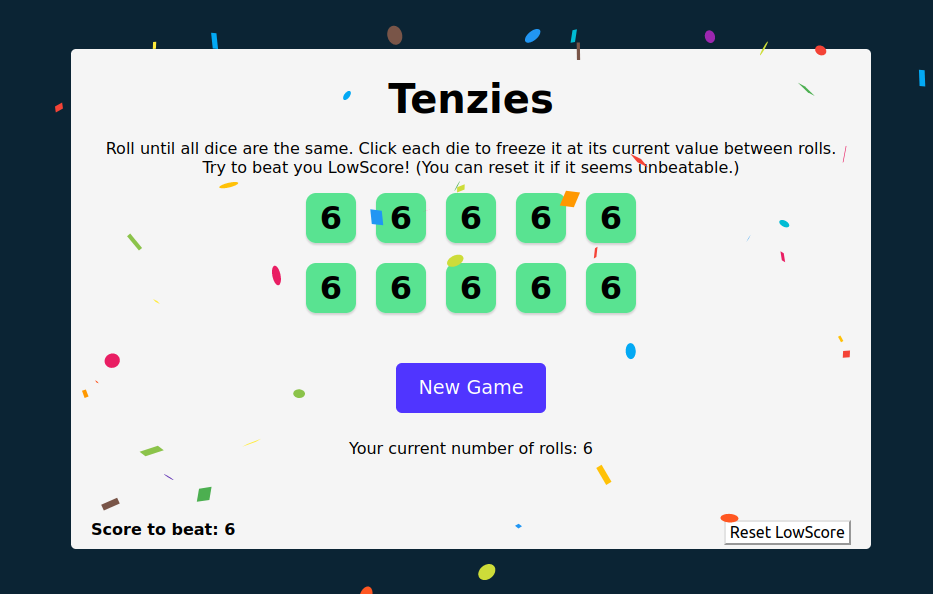

# Tenzies

A React App that lets you play the dice game of __Tenzi__. This is the final project of the great [Learn React](https://scrimba.com/learn/learnreact) Course by [Bob Ziroll](twitter.com/bobziroll). I added a "Roll Counter" and local state that lets you save the "LowScore". The app is deployed at [ben-karr.github.io/tenzies](https://ben-karr.github.io/tenzies).